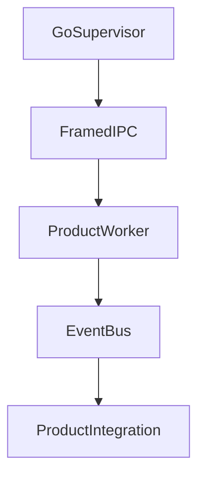

# Forge Worker Framework - Architecture Reference

For a **code-accurate** wire format and API list, see [forge-implementation-spec.md](forge-implementation-spec.md).

## Product and Infrastructure Boundaries

`Forge` is Organizyio’s infrastructure layer for local worker orchestration (framework used by products such as Organizy).

- The Go module path is **`github.com/organizyio/forge/go`**. Product repositories may use different module roots (for example Archivist under **`github.com/meshory/...`**); those paths are independent of Forge’s import string.
- The Go SDK is a single package **`forge`** at the module root, with **`internal/`** for framing and codec helpers (not importable outside the module).
- Forge owns process management, framed IPC, request/response transport, and event routing. **Job scheduling** is implemented in product code (e.g. Archivist’s `internal/scheduler`); Forge exposes `Pool` (`go/worker_pool.go`) as a container for `[]*WorkerProcess` with grouped `Start`/`Stop` that delegate to each `WorkerProcess`.
- Forge is framework-only and must remain domain-agnostic.
- Product code (workers, ingest, schemas, business workflows) lives in external repositories and depends on Forge.

## Repository Layout

```
forge/
├── protocol/
│   ├── VERSION
│   └── fixtures/
├── go/
│   ├── go.mod              # module github.com/organizyio/forge/go
│   ├── *.go                # package forge (public API)
│   └── internal/
│       ├── frame/          # length-prefixed read/write
│       └── codec/          # MessagePack / JSON wire encoding
├── rust/
│   ├── forge-worker-sdk/
│   │   ├── src/prelude.rs  # optional `use forge_worker_sdk::prelude::*` for small workers
│   │   └── tests/          # integration tests (dispatcher, framing, job registry)
│   └── examples/
│       └── minimal-worker/ # minimal WorkerHandler + run_worker CLI example
├── docs/
├── scripts/
└── Makefile
```

## Runtime Flow



## Compatibility Matrix (initial)

| Protocol | Go SDK | Rust crate |
|----------|--------|------------|
| 1.0      | 0.1.x  | forge-worker-sdk 0.1.x |

## Key Design Decisions

| Decision | Choice | Why |
|----------|--------|-----|
| Transport | Unix socket / Windows named pipe | Local-only; low overhead; OS-managed permissions |
| Framing | 4-byte length prefix + 1-byte kind | Binary-safe and partial-read safe |
| Encoding | MessagePack (JSON debug mode) | Compact and fast while retaining debuggability |
| Concurrency | 1 active job per worker | Predictable behavior; scale by pool size |
| Restart | Exponential backoff in process supervisor | Isolates worker crashes from orchestrator |

## External Example Worker Repo

Forge does not ship product workers in this repository. Use an external example/product repository that imports:

- Go: `import forge "github.com/organizyio/forge/go"` (alias required: path ends with `go`).
- Rust SDK crate: `forge-worker-sdk` from `rust/forge-worker-sdk` (under `forge/rust`); import as `forge_worker_sdk`
